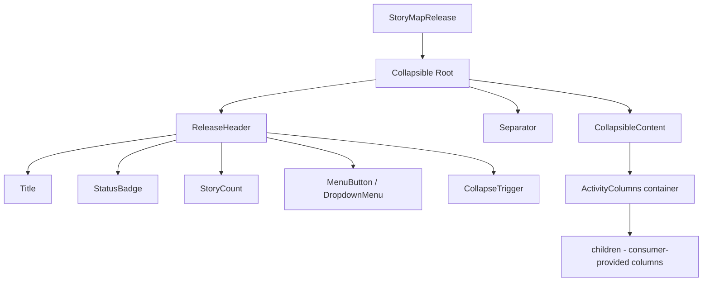

# Design Document: StoryMapRelease

## Overview

The StoryMapRelease component is a composable React component that represents a horizontal release slice in a user story map. It provides a header bar with release metadata (title, status badge, story count, action menu) and a collapsible content area for activity columns containing UserStoryCard components.

The component follows the Propeller library's established patterns: composable sub-components, `data-slot` attributes, CVA-based variants, semantic theme tokens, and shadcn/ui primitives.

## Architecture

The component is built exclusively from existing Propeller shadcn/ui components (not raw Radix primitives):

- **Collapsible, CollapsibleTrigger, CollapsibleContent** (`@/components/ui/collapsible`): Manages expand/collapse state
- **DropdownMenu, DropdownMenuTrigger, DropdownMenuContent, DropdownMenuItem, DropdownMenuSeparator** (`@/components/ui/dropdown-menu`): Provides the actions menu
- **Badge** (`@/components/ui/badge`): Displays release status
- **Separator** (`@/components/ui/separator`): Visual divider between header and content
- **Button** (`@/components/ui/button`): Menu trigger and collapse toggle



### Composition Strategy

The component exposes a flat API rather than sub-components. The consumer provides:
- Configuration props for the header (title, status, storyCount, callbacks)
- `children` for the activity columns content

This keeps the API simple since the header is not consumer-composable — its layout is fixed by design.

## Components and Interfaces

### StoryMapRelease Component

```typescript
import type { ReactNode } from "react"

export type ReleaseStatus =
  | "not started"
  | "checking readiness"
  | "ready for build"
  | "building"

export interface StoryMapReleaseProps {
  /** Release title. Defaults to "Untitled Release". */
  title?: string
  /** Current release status displayed as a badge. */
  status: ReleaseStatus
  /** Total number of stories across all activity columns. */
  storyCount: number
  /** Called when "Check Readiness" is selected from the menu. */
  onCheckReadiness?: () => void
  /** Called when "Edit" is selected from the menu. */
  onEdit?: () => void
  /** Called when "Delete" is selected from the menu. */
  onDelete?: () => void
  /** Whether the content area is expanded. Uncontrolled by default (starts expanded). */
  defaultOpen?: boolean
  /** Controlled open state. */
  open?: boolean
  /** Called when the open state changes. */
  onOpenChange?: (open: boolean) => void
  /** Activity columns content (consumer-provided). */
  children?: ReactNode
  /** Style overrides for the root element. */
  className?: string
}
```

### Status Badge Variant Mapping

Each `ReleaseStatus` maps to a visual treatment on the Badge:

| Status              | Badge Variant | Description                        |
|---------------------|---------------|------------------------------------|
| `"not started"`     | `secondary`   | Neutral, muted appearance          |
| `"checking readiness"` | `outline`  | In-progress indicator              |
| `"ready for build"` | `default`    | Primary/positive appearance        |
| `"building"`        | `default`     | Primary with a spinner/pulse icon  |

### Internal Helper: `getStatusBadgeProps`

```typescript
function getStatusBadgeProps(status: ReleaseStatus): {
  variant: "default" | "secondary" | "outline"
  label: string
} {
  switch (status) {
    case "not started":
      return { variant: "secondary", label: "Not Started" }
    case "checking readiness":
      return { variant: "outline", label: "Checking Readiness" }
    case "ready for build":
      return { variant: "default", label: "Ready for Build" }
    case "building":
      return { variant: "default", label: "Building" }
  }
}
```

### Component Structure (JSX outline)

All imports come from the Propeller `@/components/ui/*` modules — never from raw `@radix-ui/*` packages directly.

```tsx
import { Collapsible, CollapsibleTrigger, CollapsibleContent } from "@/components/ui/collapsible"
import { DropdownMenu, DropdownMenuTrigger, DropdownMenuContent, DropdownMenuItem, DropdownMenuSeparator } from "@/components/ui/dropdown-menu"
import { Badge } from "@/components/ui/badge"
import { Button } from "@/components/ui/button"
import { Separator } from "@/components/ui/separator"

// Structure:
<Collapsible defaultOpen={defaultOpen} open={open} onOpenChange={onOpenChange}>
  <div data-slot="story-map-release" className={cn(rootStyles, className)}>
    {/* Header */}
    <div data-slot="release-header" className="flex items-center gap-3 px-4 py-2 bg-muted/50">
      <CollapsibleTrigger asChild>
        <Button variant="ghost" size="icon-sm" aria-label={open ? "Collapse release" : "Expand release"}>
          <ChevronRight className={cn("size-4 transition-transform", open && "rotate-90")} />
        </Button>
      </CollapsibleTrigger>

      <span data-slot="release-title" className="text-sm font-medium text-foreground bg-muted/50">
        {title}
      </span>

      <Badge variant={badgeProps.variant}>{badgeProps.label}</Badge>

      <span data-slot="release-story-count" className="text-xs text-muted-foreground bg-muted/50">
        {storyCount} {storyCount === 1 ? "story" : "stories"}
      </span>

      <div className="ml-auto">
        <DropdownMenu>
          <DropdownMenuTrigger asChild>
            <Button variant="ghost" size="icon-sm" aria-label="Release actions">
              <MoreHorizontal className="size-4" />
            </Button>
          </DropdownMenuTrigger>
          <DropdownMenuContent align="end">
            <DropdownMenuItem onSelect={onCheckReadiness}>Check Readiness</DropdownMenuItem>
            <DropdownMenuItem onSelect={onEdit}>Edit</DropdownMenuItem>
            <DropdownMenuSeparator />
            <DropdownMenuItem variant="destructive" onSelect={onDelete}>Delete</DropdownMenuItem>
          </DropdownMenuContent>
        </DropdownMenu>
      </div>
    </div>

    {/* Divider */}
    <Separator />

    {/* Collapsible content */}
    <CollapsibleContent>
      <div data-slot="release-columns" className="flex">
        {children}
      </div>
    </CollapsibleContent>
  </div>
</Collapsible>
```

## Data Models

### ReleaseStatus Type

```typescript
export type ReleaseStatus =
  | "not started"
  | "checking readiness"
  | "ready for build"
  | "building"
```

This is a string literal union. No runtime data model or serialization is needed — the component is purely presentational and receives all data via props.

### Props Defaults

| Prop           | Default Value        |
|----------------|----------------------|
| `title`        | `"Untitled Release"` |
| `defaultOpen`  | `true`               |


## Correctness Properties

*A property is a characteristic or behavior that should hold true across all valid executions of a system — essentially, a formal statement about what the system should do. Properties serve as the bridge between human-readable specifications and machine-verifiable correctness guarantees.*

### Property 1: Header renders all required elements with correct story count

*For any* valid combination of `title`, `status`, and `storyCount` props, the rendered StoryMapRelease SHALL contain: a title element with the provided text (or "Untitled Release"), a badge element, a text element containing the storyCount number, a menu button, and a collapse toggle button.

**Validates: Requirements 1.1, 1.3**

### Property 2: Status badge mapping is correct for all statuses

*For any* `ReleaseStatus` value, the `getStatusBadgeProps` function SHALL return a badge variant and label string that uniquely identifies that status — specifically: "not started" → (secondary, "Not Started"), "checking readiness" → (outline, "Checking Readiness"), "ready for build" → (default, "Ready for Build"), "building" → (default, "Building").

**Validates: Requirements 1.4**

### Property 3: Collapse toggle round-trip preserves visibility

*For any* initial open state (expanded or collapsed), toggling the collapse button twice SHALL return the content area to its original visibility state.

**Validates: Requirements 3.1, 3.2**

### Property 4: Children are rendered in the content area

*For any* set of React children passed to StoryMapRelease, all children SHALL appear within the collapsible content area when the component is expanded.

**Validates: Requirements 4.2**

### Property 5: className is forwarded to the root element

*For any* className string passed to StoryMapRelease, the root element SHALL include that className in its class list.

**Validates: Requirements 6.1**

## Error Handling

This component is purely presentational with no async operations or complex state. Error scenarios are limited to:

| Scenario | Handling |
|---|---|
| `storyCount` is negative | Render the value as-is; no clamping. Consumer is responsible for valid data. |
| Callbacks are undefined | Menu items render but clicking them is a no-op. No errors thrown. |
| `children` is undefined/null | Content area renders empty. No errors. |
| Invalid `status` value | TypeScript enforces the `ReleaseStatus` union at compile time. |

## Testing Strategy

### Property-Based Tests

Use **fast-check** as the property-based testing library with **Vitest** as the test runner. Each property test runs a minimum of 100 iterations.

| Property | Test Description | Tag |
|---|---|---|
| Property 1 | Generate random valid props, render, assert all header elements present | Feature: story-map-release, Property 1: Header renders all required elements |
| Property 2 | Generate random ReleaseStatus, call getStatusBadgeProps, assert correct mapping | Feature: story-map-release, Property 2: Status badge mapping |
| Property 3 | Generate random initial open state, toggle twice, assert visibility restored | Feature: story-map-release, Property 3: Collapse round-trip |
| Property 4 | Generate random children count, render, assert all children present | Feature: story-map-release, Property 4: Children rendered |
| Property 5 | Generate random className strings, render, assert class present on root | Feature: story-map-release, Property 5: className forwarding |

### Unit / Interaction Tests (via Storybook)

Storybook interaction tests cover specific examples and edge cases:

- Default title renders "Untitled Release" when title prop is omitted (Req 1.2)
- Menu opens and shows all three actions (Req 2.1)
- Each menu action invokes its callback (Req 2.2, 2.3, 2.4)
- Component starts expanded by default (Req 3.3)
- Collapse toggle icon rotates on state change (Req 3.4)
- Separator element is present between header and content (Req 5.1)
- data-slot attributes are present on component parts (Req 6.3)
- Menu button and collapse toggle have aria-labels (Req 7.1, 7.2)
- Badge text is accessible (Req 7.3)
- Keyboard navigation reaches all interactive elements (Req 7.4)

### Testing Configuration

- **Test runner**: Vitest
- **Property-based testing**: fast-check (minimum 100 iterations per property)
- **Component rendering**: @testing-library/react
- **Interaction tests**: Storybook play functions with `storybook/test`
- Each property test MUST reference its design property with a comment tag:
  `// Feature: story-map-release, Property N: <property_text>`
